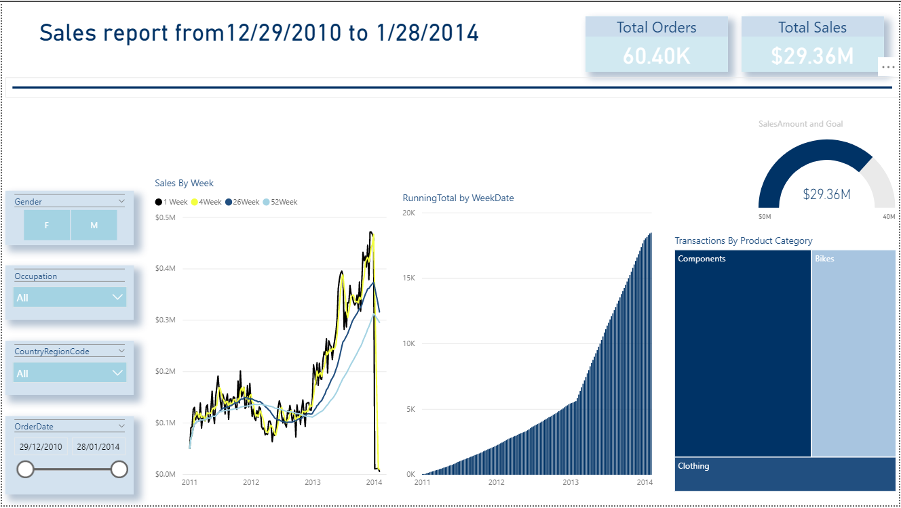

## Sales Dashboard

### AdventureWorksDW2012 is an open source Microsoft Data Warehouse

Link to DW file : https://github.com/Microsoft/sql-server-samples/releases/download/adventureworks/AdventureWorksDW2012.bak

SQL Server Database has been used to "Get data" from the Data Warehouse "AdventureWorksDW2012"
<h3> A sneek into how the dashboard looks</h3>

**Link to Dashboard**
https://app.powerbi.com/groups/fc48f6e4-19e0-47fe-a12a-8233fc9cbe2b/reports/43c6cc27-12fa-43d1-88cd-12ee8ba8637c?ctid=ef7a487a-77ca-410a-803d-e426b62a587f

